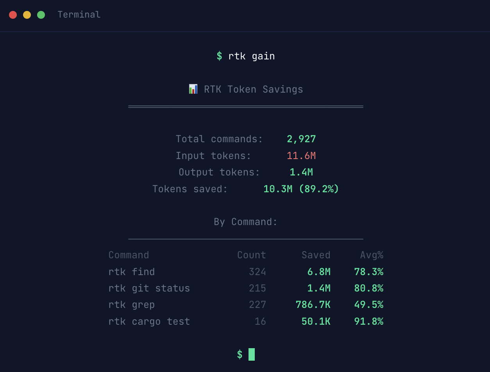

# RTK (Reduced Token Killer) for Pi

Token-optimized CLI proxy hook for [badlogic/pi-mono](https://github.com/badlogic/pi-mono).

This extension doesn't re-implement RTK — it delegates to the [RTK binary](https://github.com/rtk-ai/rtk), making it lightweight and fast. You'll automatically benefit from RTK updates without needing to update this extension.

Automatically intercepts and rewrites bash commands using RTK, saving 60-90% tokens on common dev operations.

<p align="center">
  
</p>

Learn more at [rtk-ai.app](https://www.rtk-ai.app/).

## Installation

```bash
pi install https://github.com/zogzog26/rtk-pi
```

## Prerequisites

Install the RTK binary:

```bash
brew install rtk
```

Make sure `rtk` is in your PATH.

## Usage

When Pi executes bash commands, RTK will automatically intercept and optimize them. 

Run `rtk gain` to check on your token savings.

## Uninstall

```bash
pi uninstall https://github.com/zogzog26/rtk-pi
```

## License

MIT
